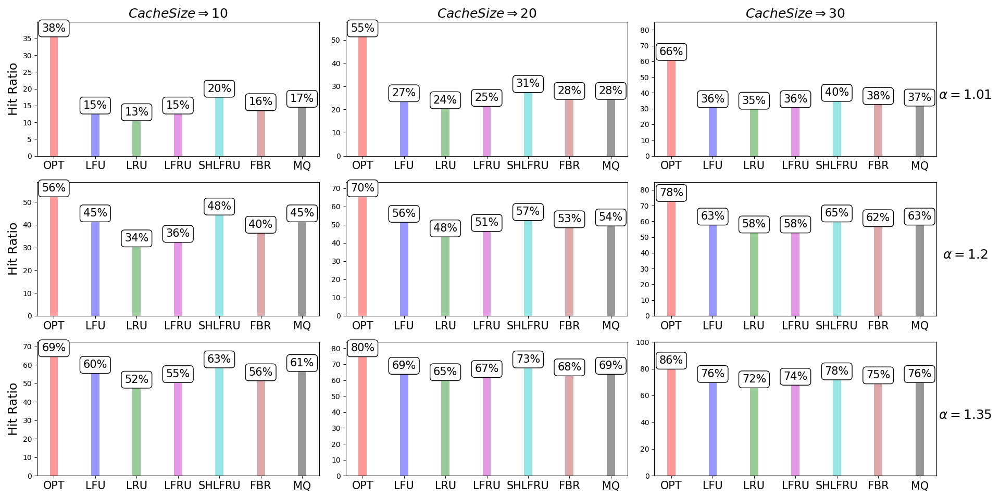
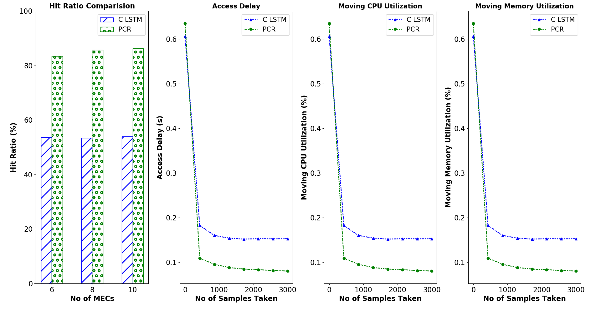

# Predictive Caching using Association
Full Implementation of A Novel Predictive-Collaborative-Replacement (PCR) Algorithm for MECs

## Simulation Experiment
* To run the simulation test `python3 caching/test_files/compare1.py`
* The Result can be seen below



## Emulation Experiment
* To Carry out the emulation experiment you will need a GNS3 platform
* Setup and download of GNS3 is available [here](https://www.gns3.com/)
* To run the C-LSTM `python3 LSTM_caching/predictive_caching.py --n=x` where x is the number of MECs deployed
* TO run PCR `python3 4proposed.py --n=x --ip=address` where x is the number of MECs deployed and address is the ip address of the MQTT broker
* The Results can be seen below


### Emulation Experiment SETUP and Installation
* To run setup on ubuntu run the `ubuntu_setup.sh`
* To run setup on aline run `alpine_setup.sh`

#### Note for alpine use
refere to [link](https://gist.github.com/orenitamar/f29fb15db3b0d13178c1c4dd611adce2) on how to install dependencies


#### Installing FTP in Linux
```bash
sudo apt-get install vsftpd
```
#### Edit conf
* change to ```anonymous_enable=YES```
```bash
nano /etc/vsftpd.conf
```
###### /etc/vsftpd.conf
```markdown
# Allow anonymous FTP? (Disabled by default).
anonymous_enable=YES
```
* restart FTP Server
```bash
/etc/init.d/vsftpd restart
```
* [Tutorial link](https://www.youtube.com/watch?v=GijFysBqaFs) to configure in ubuntu
* [Tutorial link](https://www.hiroom2.com/2018/09/01/alpinelinux-3-8-vsftpd-en/) to configure in alpine

###### you can use the config file in this dir (vsftpd)
```bash
cp vsftpd.conf /etc/
```

* save files in `/srv/ftp` to be shared by ftp

#### Content Server
[Netlify Application](https://competent-euler-834b51.netlify.app)

#### Name Server
To deploy the name server refer to [Link](https://github.com/emylincon/caching_chain)

#### MQTT Broker
To deploy the MQTT broker refer to [link](https://github.com/emylincon/mqtt)

#### PreBuilt Docker Images

Alpine Image =>  `ugwuanyi/alpine_cache3`

Ubuntu Image => `ugwuanyi/ubuntu_tf3`

Name server =>  `ugwuanyi/nameserver`