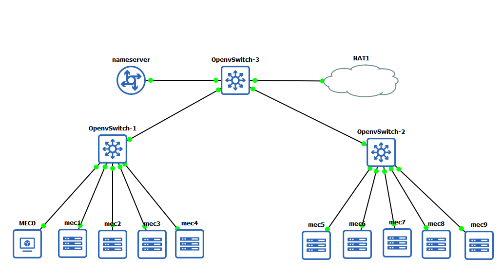

# Predictive Caching using Association
Full Implementation of A Novel Predictive-Collaborative-Replacement (PCR) Algorithm for MECs

## Simulation Experiment
* To run the simulation test `python3 caching/test_files/compare1.py`
* The Result can be seen below


## Emulation Experiment
* To Carry out the emulation experiment you will need a GNS3 platform
* Setup and download of GNS3 is available [here](https://www.gns3.com/)
* To run the C-LSTM `python3 LSTM_caching/predictive_caching.py --n=x --ip=address --result_server=z` where x is the number of MECs deployed, address is the ip address of the MQTT broker, and z is the result server ip
* TO run PCR `python3 4proposed.py --n=x --ip=address --name_server=y --result_server=z` where x is the number of MECs deployed, address is the ip address of the MQTT broker, y is the ip address of the name server, and z is the result server ip 
* The Results can be seen below


### Emulation Experiment SETUP and Installation
use the latest docker image `ugwuanyi/ubuntu_tf3` and run `git pull https://github.com/emylincon/caching`
* To run setup on ubuntu run the `ubuntu_setup.sh`
* To run setup on alpine run `alpine_setup.sh`

#### Note for alpine use
refere to [link](https://gist.github.com/orenitamar/f29fb15db3b0d13178c1c4dd611adce2) on how to install dependencies


#### Installing FTP in Linux
```bash
sudo apt-get install vsftpd
```
#### Edit conf
* change to ```anonymous_enable=YES```
```bash
nano /etc/vsftpd.conf
```
###### /etc/vsftpd.conf
```markdown
# Allow anonymous FTP? (Disabled by default).
anonymous_enable=YES
```
* restart FTP Server
```bash
/etc/init.d/vsftpd restart
```
* [Tutorial link](https://www.youtube.com/watch?v=GijFysBqaFs) to configure in ubuntu
* [Tutorial link](https://www.hiroom2.com/2018/09/01/alpinelinux-3-8-vsftpd-en/) to configure in alpine

###### you can use the config file in this dir (vsftpd)
```bash
cp vsftpd.conf /etc/
```

* create directory `/srv/ftp/cache` to be shared by MECs

#### Content Server
[Netlify Application](https://competent-euler-834b51.netlify.app)

#### Name Server
To deploy the name server refer to [Link](https://github.com/emylincon/caching_chain)

#### MQTT Broker
To deploy the MQTT broker refer to [link](https://github.com/emylincon/mqtt)

#### PreBuilt Docker Images

Alpine Image =>  `ugwuanyi/alpine_cache3`

Ubuntu Image => `ugwuanyi/ubuntu_tf3`

Name server =>  `ugwuanyi/nameserver`

# To Run the Demo
GNS3 Architecture

[Follow Along Setup YouTube Video](https://www.youtube.com/watch?v=TwOJpM-YvOs&ab_channel=jamesking)
1. start name server
```shell
/etc/init.d/nginx start
gunicorn server:app
```
	
2. start broker 
```shell
/etc/init.d/mosquitto start
```

3. setup result server
   * Pull and run setup
```shell
git pull https://github.com/emylincon/caching
cd caching
sudo sh ubuntu_setup.sh
sudo sh LSTM_ubuntu.sh
````
  * install FTP server on result server
```shell
sudo apt install vsftpd
cp vsftpd.conf /etc/
/etc/init.d/vsftpd restart
```
    
4. start FTP server and SSH server on all MECs
```shell
/etc/init.d/vsftpd start ; /etc/init.d/ssh start
```

5. copy ssh key from all mecs to the result server
```shell
ssh-keygen -t rsa ; ssh-copy-id osboxes@result_server_ip
```

6: start application
```shell
sh clean_up.sh ; cd python3 7demo.py --n=5 --ip=broker_ip --name_server=name_server_ip --result_server=result_server_ip

```
	
7: run control 
```shell
python3 control1.py
```
